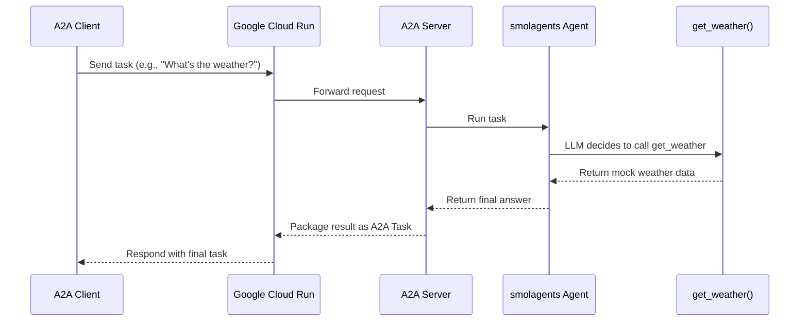

# Smolagents Agent with A2A on Google Cloud Run

This sample demonstrates how to wrap an agent built with the [smolagents](https://github.com/huggingface/smolagents) library, expose it via the Agent-to-Agent (A2A) protocol, and deploy it as a serverless container on Google Cloud Run.

The agent is a simple `ToolCallingAgent` that uses a mock weather tool. The focus of this example is on the integration patterns between `smolagents`, the A2A SDK, and Google Cloud Run.

## How It Works

A user interacts with an A2A client, which sends a request to the A2A server hosted on Cloud Run. The server's `AgentExecutor` passes the request to the `smolagents` agent, which processes the natural language query, calls the appropriate tool, and returns a final answer. The entire application is packaged as a container and deployed to a scalable, serverless environment.



## Prerequisites

-   Python 3.12+
-   [UV](https://docs.astral.sh/uv/) package manager
-   A Google Cloud Platform (GCP) project with the [Billing API](https://console.cloud.google.com/billing), [Cloud Build API](https://console.cloud.google.com/apis/library/cloudbuild.googleapis.com), and [Cloud Run API](https://console.cloud.google.com/apis/library/run.googleapis.com) enabled.
-   [Google Cloud SDK](https://cloud.google.com/sdk/docs/install) installed and authenticated (`gcloud auth login` and `gcloud config set project YOUR_PROJECT_ID`).
-   An API key for an LLM supported by LiteLLM (e.g., OpenAI, Anthropic, Gemini). This example is configured for OpenAI.

## Local Setup & Running

1.  **Navigate to the sample directory:**

    ```bash  
    cd docs/cloudrun-a2a  
    ```

2.  **Create an environment file:**

    Copy `.env.example` to `.env` and add your OpenAI API key. This will be used for the model via LiteLLM.

    ```bash  
    cp .env.example .env
    # Now, edit .env to add your OPENAI_API_KEY
    ```

3.  **Set up the Python environment and install dependencies:**

    ```bash  
    uv venv --python 3.12 
    source .venv/bin/activate  
    uv sync  
    ```

4.  **Run the agent server locally:**

    ```bash  
    uv run .
    # The server will start on http://localhost:8080
    ```

5.  **Test with an A2A client:**
    In a separate terminal (with the venv activated), you can use the sample A2A CLI client to interact with the agent:

    ```bash  
    git clone https://github.com/a2aproject/a2a-samples /tmp/a2a-samples
    cd /tmp/a2a-samples/samples/python/hosts/cli  
    uv run . --agent http://localhost:8080  
    ```
    The output should be something like this:

    ```bash
    ======= Agent Card ========
    {"capabilities":{"streaming":false},"defaultInputModes":["text","text/plain"],"defaultOutputModes":["text","text/plain"],"description":"An agent that provides delightfully grim weather forecasts.","name":"Smol Weather Agent","protocolVersion":"0.2.6","skills":[{"description":"Provides a completely unserious and pessimistic weather forecast.","examples":["What is the weather like in Paris?"],"id":"get_weather","name":"Get Weather Forecast","tags":["weather","forecast","humor"]}],"url":"http://0.0.0.0:8080/","version":"0.1.0"}
    ```
    
6.  **Send a task to the agent:**

## Deploy to Google Cloud Run

Deploying to Cloud Run packages your code into a container and runs it in a managed environment. We will use the source-based deployment feature, which uses Google Cloud Build to automatically build the container from your source code using the provided `Dockerfile`.

1.  **Set Environment Variables for Deployment:**

    Replace `YOUR_PROJECT_ID` and `YOUR_REGION` with your GCP project ID and desired region (e.g., `us-central1`).

    ```bash  
    export PROJECT_ID=$(gcloud config get-value project)
    export REGION="YOUR_REGION"  
    export SERVICE_NAME="a2a-smolagent-weather-demo"  
    ```

2.  **Store your API Key in Secret Manager:**

    For better security, we'll store the API key in Google Secret Manager instead of passing it directly as an environment variable.

    ```bash
    # Create the secret
    echo "your_openai_api_key_here" | gcloud secrets create openai-api-key --data-file=- --project=$PROJECT_ID

    # Grant the default Cloud Run service account access to the secret
    # First, get the project number
    PROJECT_NUMBER=$(gcloud projects describe $PROJECT_ID --format='value(projectNumber)')
    # Then, grant the role
    gcloud secrets add-iam-policy-binding openai-api-key \  
    --member="serviceAccount:${PROJECT_NUMBER}-compute@developer.gserviceaccount.com" \  
    --role="roles/secretmanager.secretAccessor" \  
    --project=$PROJECT_ID  
    ```

3.  **Deploy the Service:**

    Run the following command from the `docs/cloudrun-a2a` directory. This command tells Cloud Build to use your source code, build a container, and deploy it to Cloud Run.

    ```bash  
    gcloud run deploy $SERVICE_NAME \  
    --source . \  
    --platform=managed \
    --region $REGION \  
    --project $PROJECT_ID \  
    --allow-unauthenticated \  
    --set-secrets="OPENAI_API_KEY=openai-api-key:latest" \  
    --set-env-vars="APP_URL_OVERRIDE=auto"  
    ```

    -   `--source .`: Deploys from the current directory.
    -   `--allow-unauthenticated`: Makes the service publicly accessible. The A2A protocol has its own security mechanisms if needed.
    -   `--set-secrets`: Securely mounts our API key from Secret Manager into the `OPENAI_API_KEY` environment variable.
    -   `--set-env-vars="APP_URL_OVERRIDE=auto"`: This is a custom flag used by our `__main__.py` to automatically detect the Cloud Run service URL for the `AgentCard`.

    After the deployment completes, `gcloud` will output the **Service URL**. You can use this URL with the A2A CLI client to interact with your deployed agent.

    ```bash
    export SERVICE_URL=$(gcloud run services describe $SERVICE_NAME --platform managed --region $REGION --format 'value(status.url)')
    gcloud run services update $SERVICE_NAME --set-env-vars SERVICE_URL=$SERVICE_URL
    ```

**NOTE:** This all isn't quite right. Someone should verify / update / open issues. All the steps are there, but I did them kind of out of order.

You can use this URL with the A2A CLI client to interact with your deployed agent.

## Disclaimer

Important: The sample code provided is for demonstration purposes and illustrates the mechanics of the Agent-to-Agent (A2A) protocol. When building production applications, it is critical to treat any agent operating outside of your direct control as a potentially untrusted entity.

All data received from an external agent—including but not limited to its AgentCard, messages, artifacts, and task statuses—should be handled as untrusted input. For example, a malicious agent could provide an AgentCard containing crafted data in its fields (e.g., description, name, skills.description). If this data is used without sanitization to construct prompts for a Large Language Model (LLM), it could expose your application to prompt injection attacks. Failure to properly validate and sanitize this data before use can introduce security vulnerabilities into your application.

Developers are responsible for implementing appropriate security measures, such as input validation and secure handling of credentials to protect their systems and users.  